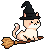

# CAT WITCH MISSION :smirk_cat: :witch: :dizzy:

## [Play the Game!](https://aybikecv.github.io/Cat-Witch-Mission/)

# Description

Our cat witch, as a loyal companion, needs your help in order to save its witch friend which was taken captive by the evil witch. You direct the cat with the arrow keys and collect the potions and books. Avoiding the spells and the witch is a must if you want to keep play.

# Main Functionalities

- Character movements (Smooth cat movements/ main Witch movement + surprise movement)
- Character collisions
- Objects (collectibles, and obstacles) movements
- Collectibles give you 10 points.
- Spells take one of your lives.
- If the cat touches witch in a normal witch movement or vice versa, you lose 1 life.
- If the cat touches witch in surprise movement or vice versa, you lose 2 lives.
- Score
- Lives Container
- Music

# Backlog Functionalities

- Adding another cat character and choose your character section.
- CatNip as a collectible, gives you extra life :herb: :heart:
- Sleep spells as an obstacle, makes you stop for 2 seconds :zzz:
- Sending spells from the witch instead of appearing randomly.
- Collision sounds
- Higher Score-Level Ups
- With the level ups, actually saving the friend

# Technologies used

- HTML
- CSS
- JavaScript
- DOM Manipulations
- JS Classes
- GitHub
- GitHub projects for planning
- Royalty free audios and images
- Peaphoto
- Local Storage

# States

- Welcome/Start Screen
- Game Screen-Game Box
- Game Over Screen

# Proyect Structure

## MainGame.js

- gameStart();
- gameloop();
- witchWallCollisionCheck();
- spawnCollectible();
- deSpawnCollectible();
- spawnObstacle();
- deSpawnObstable();
- clearAllIntervals();
- gameOver();
- initGame();
- rePlay();
- addingUI();
- playMeow();
- playGameMusic();
- minusLives();

## Cat.js
- class Cat
- this.node
- this.x;
- this.y;
- this.width;
- this.height;
- this.node.style.width;
- this.node.style.height;
- this.node.style.left =;
- this.node.style.top;
- this.node.style.position;
- this.node.style.border;
- this.node.classList.add("cat");
- this.directionX;
- this.directionY;
- this.isUndefeated;
- move() 
- didCollide(collectibles) 
- didCollide(obsctacles) 
- didCollide(witchObj) 
- didCollideCollectibles() 
- didCollideObstacles() 
- didCollideWitch() 
- addingUI();

## Witch.js 

- this.node;
- this.node.src
- this.x;
- this.y;
- this.width;
- this.height;
- this.node.style.width;
- this.node.style.height;
- this.node.style.left;
- this.node.style.top;
- this.node.style.position;
- this.node.style.border;
- this.node.classList.add("witch");
- this.directionX;
- this.directionY;
- this.speed;
- this.mode;
- this.isMovingDown;  
- automaticMovement();
- triggerScare();

## Collectibles.js

- this.type;
- this.node;
- this.x;
- this.y;
- this.width;
- this.height;
- this.node.style.width;
- this.node.style.height;
- this.node.style.left;
- this.node.style.top;
- this.node.style.position;
- this.node.style.border =
- this.node.classList.add("collectibles");
- this.speed;
- automaticMovement() 

## Obstacles.js

- this.node;
- this.node.src;
- this.x;
- this.y;
- this.width;
- this.height;
- this.node.style.width;
- this.node.style.height;
- this.node.style.left;
- this.node.style.top;
- this.node.style.position;
- this.node.style.border;
- this.node.classList.add("obstacles");
- this.speed;
- automaticMovement() 

# Extra Links 

### GitHub
[Link](https://github.com/AybikeCV/Cat-Witch-Mission)

### Slides
[Link](https://docs.google.com/presentation/d/1cQei1uk7VAoKQbtL8T3eWxomaIfR0N_KStBGbU7Kv4U/edit?usp=sharing)

## Deploy
[Link](https://aybikecv.github.io/Cat-Witch-Mission/)
